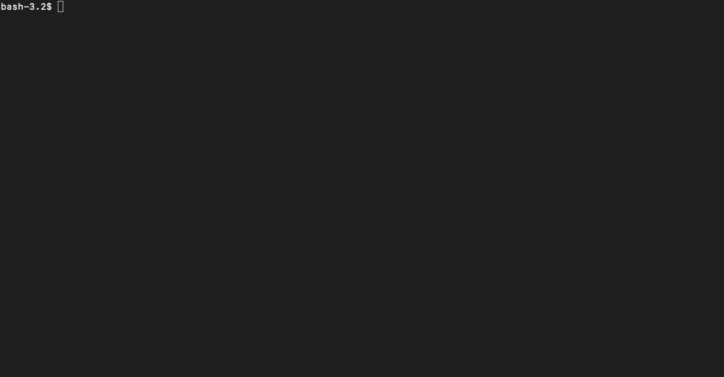
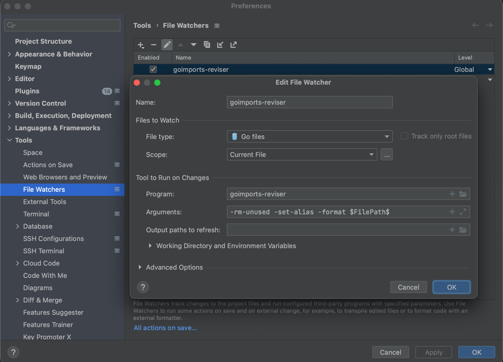

# goimports-reviser [](https://twitter.com/intent/tweet?text=Right%20golang%20imports%20sorting%20and%20code%20formatting%20tool%20(goimports%20alternative)&url=https://github.com/incu6us/goimports-reviser&hashtags=golang,code,goimports-reviser,goimports,gofmt,developers)


[](https://codecov.io/gh/incu6us/goimports-reviser)


[](https://snapcraft.io/goimports-reviser)


Tool for Golang to sort goimports by 3 groups: std, general and project dependencies.
Also, formatting for your code will be prepared(so, you don't need to use `gofmt` or `goimports` separately). 
Use additional option `-rm-unused` to remove unused imports and `-set-alias` to rewrite import aliases for versioned packages.

## Install
### With Brew
```bash
brew tap incu6us/homebrew-tap
brew install incu6us/homebrew-tap/goimports-reviser
```

### With Snap
```bash
snap install goimports-reviser
```

## How To Use


Before usage:
```go
package testdata

import (
	"log"

	"github.com/incu6us/goimports-reviser/testdata/innderpkg"

	"bytes"

	"github.com/pkg/errors"
)
``` 

After usage:
```go
package testdata

import (
	"bytes"
	"log"
	
	"github.com/pkg/errors"
	
	"github.com/incu6us/goimports-reviser/testdata/innderpkg"
)
```

Comments(not Docs) for imports is acceptable. Example:
```go
package testdata

import (
    "fmt" // comments to the package here
)
```  

### Options:
```text
  -file-path string
    	File path to fix imports(ex.: ./reviser/reviser.go). Required parameter.
  -project-name string
    	Your project name(ex.: github.com/incu6us/goimports-reviser). Required parameter.
  -rm-unused
    	Remove unused imports. Optional parameter.
  -set-alias
        Set alias for versioned package names, like 'github.com/go-pg/pg/v9'. 
        In this case import will be set as 'pg "github.com/go-pg/pg/v9"'. Optional parameter.
  -version
    	Show version.
```

## Examples:
### Cmd
```bash
goimports-reviser -project-name github.com/incu6us/goimports-reviser -file-path ./reviser/reviser.go -rm-unused -set-alias
```

### Example, to configure it with JetBrains IDEs (via file watcher plugin):

